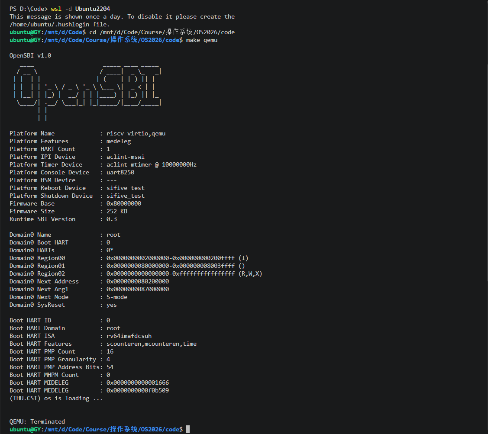
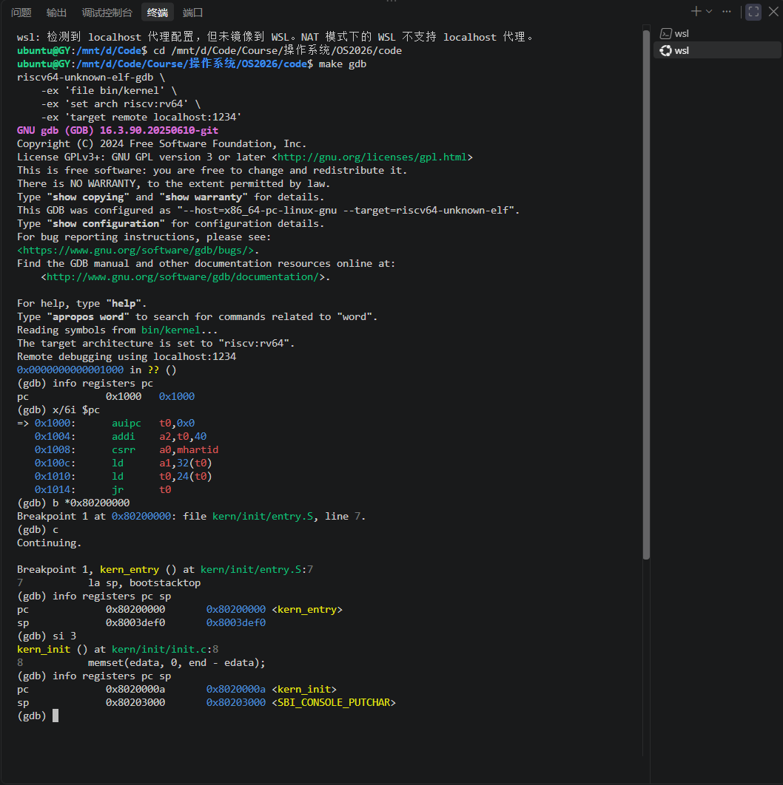

# 操作系统实验报告

## 实验基本信息

| 项目               | 内容                                                 |
| ------------------ | ---------------------------------------------------- |
| **实验名称** | Lab 1: 比麻雀更小的麻雀（最小可执行内核）            |
| **小组成员** | 2412799-葛熠（队长）、2412133-吕鹏哲、2412679-钟一成 |
| **完成日期** | 2026-10-05                                           |

### 小组分工

**练习分工**：三条线并行——葛熠负责环境与构建（Makefile / 交叉编译 / QEMU 跑通），钟一成负责练习1（内核入口与链接脚本分析），吕鹏哲负责练习2（GDB 调试与启动流程验证）；各人的结论互相复核（练习1 的机器码证据由葛熠用 `objdump`/`nm` 复核，练习2 的调试日志由钟一成复核）。

| 成员           | 负责的练习/模块                                    |
| -------------- | -------------------------------------------------- |
| 2412799-葛熠   | 环境与构建（Makefile / 交叉编译 / QEMU）+ 报告统稿 |
| 2412133-吕鹏哲 | 练习2：GDB 调试与启动流程验证                      |
| 2412679-钟一成 | 练习1：内核入口与链接脚本分析                      |

**报告分工**：各人先交自己负责部分的原始材料（分析说明、命令与输出、截图），由葛熠按实验报告模板统稿，吕鹏哲与钟一成负责校对技术描述与格式。

---

## 一、实验目的

<!-- 说明本次实验的主要目标和预期成果 -->

本实验的主要目的是：

1. 理解一台 RISC-V 计算机从加电复位到执行操作系统内核第一条指令的完整流程，理解 bootloader（OpenSBI）与内核的职责边界与交接方式
2. 掌握链接脚本、交叉编译与内核镜像（ELF → BIN）的生成机制，理解内核为什么必须被加载到 `0x80200000` 这一固定地址
3. 掌握用 QEMU 模拟硬件、用 GDB 远程调试内核的方法，并学习借助 AI 工具完成底层系统实验

---

## 二、实验环境

你们使用的 AI 工具

| 成员           | AI 编程工具                     | 底层模型            | 备注                                                    |
| -------------- | ------------------------------- | ------------------- | ------------------------------------------------------- |
| 2412799-葛熠   | VS Code + Copilot（Agent 模式） | DeepSeek V4.1 Flash | 直接在仓库中改文件、在 WSL 执行 make/qemu/gdb、提交推送 |
| 2412133-吕鹏哲 | 待补充                          | 待补充              |                                                         |
| 2412679-钟一成 | Codex（ChatGPT，Agent 模式）    | GPT-5               | 辅助代码阅读、命令执行和实验分析                        |

**说明：**

- **AI 编程工具**：指具体使用的终端工具、编辑器插件、桌面应用或浏览器界面
- **底层模型**：指该工具使用的大语言模型及版本

---

## 三、实验整体逻辑分析

### 3.1 本章节的逻辑主线

本章围绕一个核心问题展开：**一台计算机通电之后，是怎么走到“操作系统的第一条指令”的**。答案是三级接力，本章的关键词是**交接**：

```
硬件（复位向量 0x1000 的 MROM） --跳转--> 固件 OpenSBI（0x80000000，M 态） --跳转--> 内核（0x80200000，S 态）
```

为了让这条交接链可靠发生，本章要解决三件事：

1. **内核放在哪、怎么保证它被放在那**：用链接脚本把段的起始地址钉死在 `0x80200000`（因为 OpenSBI 固定往这里跳），并让 `kern_entry` 位于镜像最前面；
2. **内核是什么格式、怎么生成**：交叉编译得到 RISC-V 的 ELF，再用 `objcopy` 剥掉符号表和 ELF 头，得到 QEMU 能直接装进内存的纯二进制镜像 `ucore.img`；
3. **内核在最裸的状态下怎么“说话”**：此时没有设备驱动、没有中断系统，只能通过 `ecall` 借用固件 OpenSBI 提供的 console 服务输出字符。

把这三件事做成，就得到一个“最小可执行内核”：能被装进内存、能建立自己的 C 运行环境、能打印一行字证明自己活着。

### 3.2 功能的逐步实现

按代码之间的依赖关系，从“最先必须存在”的开始：

1. **先定内存布局**（`tools/kernel.ld`）：`ENTRY(kern_entry)`、`. = 0x80200000`，按 `.text → .rodata → .data（含 bootstack）→ .bss` 排列，并用 `PROVIDE(edata/end)` 把段边界暴露给 C 代码。
   *为什么先做*：地址是后面一切的基准——链接地址决定了镜像里每条 PC 相对指令的编码，也决定了 OpenSBI 必须跳到哪。
2. **再写汇编入口**（`kern/init/entry.S`）：把 `sp` 设为 `bootstacktop`（建立内核栈），然后 `tail kern_init` 移交控制权。
   *为什么第二步*：此时 C 运行环境还不存在，只有汇编能在“没有栈”的状态下工作，而任何 C 函数一被调用就要用栈。
3. **然后进入 C 入口**（`kern/init/init.c` 的 `kern_init()`）：清 BSS（`memset(edata, 0, end - edata)`，lab1 中 `.bss` 为空，实际是空操作）、打印启动信息、`while (1);` 停住。
   *为什么第三步*：有了栈才能进 C；这一步也标志着“内核真的跑起来了”。
4. **接着补齐输出链路**（`libs/printfmt.c` 格式化 → `kern/libs/stdio.c` 的 `cprintf` → `kern/driver/console.c` 的 `cons_putc` → `libs/sbi.c` 的 `sbi_console_putchar` → `ecall` → OpenSBI）：按“格式化逻辑 / 设备接口 / 硬件访问”三层分离。
   *为什么最后做*：可观测性是后续所有实验的基础设施，但在依赖上它要求前面三步都已就绪。
5. **最后由构建与调试闭环收尾**（`Makefile` + `tools/function.mk` → `objcopy` → `make qemu` → `make debug`/`make gdb`）：把上述环节串成一条 `make` 命令，并用 QEMU gdbstub + GDB 验证“交接”真的发生了。

一句话概括这个顺序：**先“装得进去”（链接脚本），再“跑得起来”（栈与 C 入口），再“看得见”（SBI 输出），最后“能验证”（QEMU + GDB）**。

---

## 四、实验内容与实现

<!-- 
说明：本部分按照 exercises 文档中的练习顺序组织
每个功能模块或者练习中可能包含多项任务，请根据实际情况调整
-->

### 功能模块：环境与构建 —— QEMU 启动方式修复

**负责人：** 2412799-葛熠

#### 模块功能描述

**涉及文件：** `Makefile`（`qemu`、`debug` 两个 target）、新增 `.gitattributes`

lab1 不需要实现内核功能代码，代码中唯一被改动的地方在**构建与启动**这一层：课程材料里的 `make qemu` 是按 QEMU 4.1.1 + OpenSBI v0.6 写的，在本机环境（QEMU 7.0.0 + OpenSBI v1.0）下内核根本不会被执行。本模块的作用是让“编译 → 装载 → 交接 → 输出”这条链路在当前环境下真正跑通，并让仓库在 WSL 下可稳定构建。

- **在系统中的位置**：位于“内核代码”之外、启动链之前——它决定镜像怎么生成、由谁装载、CPU 从哪里开始执行内核。
- **主要场景**：正常启动（`make qemu`）与调试启动（`make debug` + `make gdb`），两条路径必须使用同一套装载语义。
- **与其他模块的交互**：产出 `bin/kernel`（ELF，供 GDB 读符号）与 `bin/ucore.img`（纯二进制，供 QEMU 装载）；`kernel.ld` 决定镜像内部的地址布局；`entry.S` 是镜像的第一个字节。

#### 最终提示词

以下是经过迭代优化后，最终成功实现该功能的提示词（采用课程要求的四段式框架）：

````markdown
[PROMPT]
**任务**：修改 code/Makefile 中 qemu 与 debug 两个 target 的 QEMU 命令行，使内核在本机 QEMU 7.0.0 + OpenSBI v1.0 环境下能够被正确装载并执行；不改动任何内核源码逻辑。
**操作要求**：必须直接修改仓库中的实际文件；保留 Makefile 其余内容与变量定义不变，只调整这两个 target 的启动参数。
**输出要求**：给出修改后的片段与验证命令；说明该参数为什么能解决问题，并给出可观测的成功判据。

[RELY]
- 构建产物：$(UCOREIMG) = bin/ucore.img（由 objcopy --strip-all -O binary 生成的纯二进制镜像）
- 链接脚本 tools/kernel.ld：BASE_ADDRESS = 0x80200000，ENTRY(kern_entry)
- 实测现象证据：原命令
  qemu-system-riscv64 -machine virt -nographic -bios default -device loader,file=bin/ucore.img,addr=0x80200000
  启动后 OpenSBI banner 打印 `Domain0 Next Address : 0x0000000000000000`
- 环境：QEMU 7.0.0，-bios default 即 OpenSBI v1.0（fw_dynamic 固件）

[GUARANTEE]
必须修改的接口（Makefile target）：
```
qemu:   $(UCOREIMG) $(SWAPIMG) $(SFSIMG)
debug:  $(UCOREIMG) $(SWAPIMG) $(SFSIMG)
```
两个 target 必须采用一致的装载方式；允许新增注释说明原因；不删除既有 target，不改变其依赖关系。

[SPECIFICATION]
**Pre-Condition**：make 已成功生成 bin/ucore.img；QEMU/OpenSBI 版本与上述一致。
**Post-Condition**：make qemu 时能观察到内核输出 `(THU.CST) os is loading ...`；make debug 在同样装载语义下额外开启 gdbstub（-s -S）并停在复位处，等待 GDB 连接 1234 端口。
**Case 1（qemu target）**：OpenSBI 应把下一级跳转地址设为 0x80200000，CPU 从该地址取到第一条指令（kern_entry）。
**Case 2（debug target）**：除上述行为外，CPU 必须在复位后立即停止（-S）并开放 gdbstub（-s），且断点 `b *0x80200000` 能在控制权交接时命中。
**Requirements**：不得依赖内核源码改动；不得依赖特定旧版本 OpenSBI；`make clean && make && make qemu` 全流程可重复。
````

#### 实现迭代过程

本模块的实现经历了 3 次迭代。

##### 第一次迭代：照搬指导书命令

**提示词**：按实验指导书在 WSL 里执行 `make clean && make && make qemu`，确认内核能输出 `(THU.CST) os is loading ...`；不要改动任何代码，把完整输出贴回来。

**遇到的问题：**

- 编译、链接、生成镜像全部正常，QEMU 也起来了，但输出停在 OpenSBI banner，**完全没有内核输出**：

```
OpenSBI v1.0
...
Boot HART MEDELEG         : 0x0000000000f0b509
（此处本应出现 (THU.CST) os is loading ...，实际没有）
```

- 最初怀疑是内核代码问题（`cprintf` 不工作 / 串口没接上），但没有任何证据。

**问题解决策略：** 先不改代码，转而让 AI 给出“如何用最小代价判断内核到底有没有被执行”的方案——于是有了第二次迭代。

##### 第二次迭代：先定位，再动手

**提示词**：QEMU 启动后只有 OpenSBI banner，没有内核输出。要求：不改动任何代码，用最小的调试代价判断“内核从未被执行”还是“执行了但没有输出”，并给出判定依据。

**观察结果（关键证据）**：OpenSBI banner 中

```
Domain0 Next Address      : 0x0000000000000000
```

下一级跳转地址是 **0**，说明 OpenSBI 根本没有把控制权交给 0x80200000，内核从未被执行——问题被定位在**装载方式**，而不是内核代码。原因：指导书基于 QEMU 4.1.1 + OpenSBI v0.6；新版 OpenSBI 是 `fw_dynamic` 固件，只有当 QEMU 通过 `-kernel` 传入镜像（并由 QEMU 设置 `a1/a2` 传递启动信息）时，才会把 next address 设为 0x80200000。

**问题解决策略**：在提示词的 **[RELY]** 中补上环境版本（QEMU 7.0.0 / OpenSBI v1.0 fw_dynamic）与“Next Address = 0”这条实测证据，要求给出适配新版的装载方式，并明确成功判据（能看到内核输出）。

##### 第三次迭代：改 Makefile 并验证

**最终结果：** `qemu` 与 `debug` 两个 target 改用 `-kernel $(UCOREIMG)` 后：

```
Boot HART MEDELEG         : 0x0000000000f0b509
(THU.CST) os is loading ...
```

GDB 侧同时确认（见练习2）：`b *0x80200000` 能命中 `kern_entry`，随后 `sp` 被设为 `bootstacktop`。

**关键改进点总结：**

1. 在 **[RELY]** 中补充**环境版本与实测证据**（`Domain0 Next Address : 0x0`），AI 才能跳出“去改内核代码”的误区，直接指向装载方式；
2. 在 **[SPECIFICATION]** 中把成功判据写成**可观测的输出**（看见 `(THU.CST) os is loading ...`），而不是“能跑起来”这类不可验证的表述；
3. 追加发现（同属构建层）：仓库内文件行尾混杂 CRLF/LF，而 CRLF 的 `Makefile` 会让 WSL 下的 `make` 直接报错——新增 `.gitattributes`（`* text=auto eol=lf`）并重新 checkout 统一为 LF，保证 `make clean && make` 可重复。

---

### 练习1：理解内核启动中的程序入口操作

**负责人：** 2412679-钟一成

**源码**（`kern/init/entry.S`）：

```asm
#include <mmu.h>
#include <memlayout.h>

    .section .text,"ax",%progbits
    .globl kern_entry
kern_entry:
    la sp, bootstacktop

    tail kern_init

.section .data
    # .align 2^12
    .align PGSHIFT
    .global bootstack
bootstack:
    .space KSTACKSIZE
    .global bootstacktop
bootstacktop:
```

#### （1）`la sp, bootstacktop` 完成了什么

`la`（load address）是 RISC-V 汇编伪指令，展开为 `auipc sp, %pcrel_hi(bootstacktop)` + `addi sp, sp, %pcrel_lo(bootstacktop)`，即**以 PC 相对寻址的方式，把符号 `bootstacktop` 的地址装入栈指针 `sp`**。

编译链接后用 `riscv64-unknown-elf-objdump -d bin/kernel` 可以看到（链接器做了松弛优化）：

```
0000000080200000 <kern_entry>:
    80200000: 00003117      auipc sp,0x3
    80200004: 00010113      mv    sp,sp          # addi sp,sp,0 的残留
    80200008: a009          j     8020000a <kern_init>
```

即 `sp = 0x80200000 + 0x3000 = 0x80203000`，与符号表一致（`riscv64-unknown-elf-nm bin/kernel`）：

```
0000000080200000 T kern_entry
000000008020000a T kern_init
0000000080201000 D bootstack
0000000080203000 D bootstacktop
```

**目的**：为 C 语言函数的调用准备内核栈。RISC-V 不同于 x86，**没有硬件栈机制**，`sp` 只是一个普通通用寄存器，必须由软件显式设置。`bootstacktop` 是同一文件 `.data` 段中 `bootstack`（`.space KSTACKSIZE`，即 `2 × 4096 = 8KB`）的高地址端：

| 符号             | 地址           | 含义                                |
| ---------------- | -------------- | ----------------------------------- |
| `bootstack`    | `0x80201000` | 栈底（低地址）                      |
| `bootstacktop` | `0x80203000` | 栈顶（高地址），也是`sp` 的初始值 |

RISC-V 的栈是**向低地址增长**的，所以 `sp` 必须指向这块内存的**高地址端**（`bootstacktop`）而不是 `bootstack`；前面的 `.align PGSHIFT` 保证它页对齐（实测 `0x80203000` 是 4KB 对齐的地址），满足 RISC-V 调用约定对栈指针对齐的要求。

如果不先设置 `sp` 就直接调用 C 函数，编译器生成的 `sd ra, ...(sp)`、局部变量入栈等指令会写到未定义的内存上，内核必然崩溃。

**为什么不能沿用 OpenSBI 留下的 `sp`**：此时 CPU 刚从 M 态固件（OpenSBI）跳入 S 态内核，`sp` 指向的是 **M 态固件自己的栈**。内核如果直接使用，会踩坏固件的数据；而且那块内存的归属与管理并不属于内核。因此内核入口的第一件事就是用自己的静态内存（`.data` 段的 `bootstack`）建立私有栈。

#### （2）`tail kern_init` 完成了什么

`tail` 是 RISC-V 的伪指令，展开为 `auipc t1, %pcrel_hi(kern_init)` + `jalr x0, t1, %pcrel_lo(kern_init)`：**跳转到 `kern_init` 并把返回地址写入 `x0`（丢弃）**，临时寄存器用 `t1`，因此不修改返回地址寄存器 `ra`。本例中 `kern_init` 恰好紧跟其后，链接器在松弛阶段直接化简为一条 `j 8020000a <kern_init>`（见上面反汇编）。

**目的**：把控制权从汇编入口 `kern_entry` 移交给 C 语言写的内核初始化函数 `kern_init()`，从此开始执行 C 代码。

**为什么用 `tail` 而不是 `call` / `jal`**：

1. `kern_init()` 的声明是 `int kern_init(void) __attribute__((noreturn))`，函数体末尾是 `while (1);`，**永远不会返回**。既然不会返回，保存返回地址就没有任何意义。
2. 语义上这是「**移交控制权**」而不是「调用」：不需要为被调用者建立新的栈帧，也不需要 `ra` 记录“是谁调用的我”（`kern_init` 内部若用到 `ra` 也不会破坏任何有效信息）。这使入口处的栈状态保持最简：`sp` 一设好就直接进 C 函数。
3. 寻址范围：`jal` 的相对跳转立即数只有 20 位（±1MB），而 `tail`（`auipc` + `jalr`）可以达到 PC 相对 ±2GB，因此不要求 `kern_init` 在链接后恰好落在 `kern_entry` 附近。

#### （3）补充观察

在 `kern_init()` 开头还有一句 `memset(edata, 0, end - edata);`，作用是清除 BSS 段。从符号表可以看到：

```
0000000080203008 D edata
0000000080203008 D end
```

lab1 里 `edata == end`（`.bss` 为空，内核没有未初始化的全局/静态变量），所以这一步目前实际是空操作；它是为后续引入 BSS 变量的实验准备的。这也从侧面说明：`entry.S` 只做“建栈 + 移交控制权”两件事，BSS 清零这类 C 运行环境准备交给了 `kern_init()`。

---

### 练习2：使用 GDB 验证启动流程

**负责人：** 2412133-吕鹏哲

#### 调试环境与方式

内核运行在 QEMU 里，无法像普通程序那样直接启动调试器，因此改用 **QEMU gdbstub 远程调试**：一个终端跑 `make debug`（即 `qemu-system-riscv64 -machine virt -nographic -bios default -kernel bin/ucore.img -s -S`，`-S` 让 CPU 在复位后立刻停住等 GDB，`-s` 在 1234 端口开 gdbstub），另一个终端跑 `make gdb`（`riscv64-unknown-elf-gdb -ex 'file bin/kernel' -ex 'set arch riscv:rv64' -ex 'target remote localhost:1234'`）。

#### 调试过程与观察记录

**① 加电复位：PC = 0x1000**

```
(gdb) info registers pc
pc             0x1000	0x1000
(gdb) x/6i $pc
=> 0x1000:	auipc	t0,0x0          # t0 = 0x1000，作后续取数据的基址
   0x1004:	addi	a2,t0,40        # a2 = 0x1028（fw_dynamic info 结构体地址）
   0x1008:	csrr	a0,mhartid      # a0 = 当前 hart id
   0x100c:	ld	a1,32(t0)       # a1 = *(0x1020) = 0x87000000（DTB 地址）
   0x1010:	ld	t0,24(t0)       # t0 = *(0x1018) = 0x80000000（固件入口）
   0x1014:	jr	t0              # 跳转到 OpenSBI
```

**② 单步 6 条指令，控制权进入 OpenSBI**

```
(gdb) si 6
(gdb) info registers pc t0 a2
pc   0x80000000
t0   0x80000000
a2   0x1028
(gdb) x/4i $pc
=> 0x80000000:	add	s0,a0,zero     # 保存 a0/a1/a2（hart id / DTB / fw_dynamic info）
   0x80000004:	add	s1,a1,zero
   0x80000008:	add	s2,a2,zero
   0x8000000c:	jal	0x80000560     # 进入 OpenSBI 主初始化
```

MROM 中的常量表也验证了上面的参数来源：

```
(gdb) x/4gx 0x1018
0x1018:	0x0000000080000000	0x0000000087000000
0x1028:	0x000000004942534f	0x0000000000000002      # 魔数 "OSBI" + 版本 2
```

**③ 在 0x80200000 打断点，验证“控制权交接”**

```
(gdb) x/4i 0x80200000                 # 复位时该地址已经放着内核镜像
   0x80200000 <kern_entry>:	auipc	sp,0x3
(gdb) b *0x80200000
Breakpoint 1 at 0x80200000: file kern/init/entry.S, line 7.
(gdb) c
Breakpoint 1, kern_entry () at kern/init/entry.S:7
7	    la sp, bootstacktop
(gdb) info registers pc sp
pc             0x80200000	0x80200000 <kern_entry>
sp             0x8003def0	0x8003def0               # 仍是 OpenSBI 的栈
(gdb) si 3
(gdb) info registers pc sp
pc             0x8020000a	0x8020000a <kern_init>
sp             0x80203000	0x80203000 <SBI_CONSOLE_PUTCHAR>   # = bootstacktop
```

`sp` 从 `0x8003def0`（OpenSBI 在 0x8003xxxx 区域的栈）变成 `0x80203000`（`bootstacktop`），与练习1 的结论互相印证。

**④ 一个与指导书 tip 不同的观察**

指导书建议用 `watch *0x80200000` 观察内核被加载的瞬间。实测在本环境（QEMU 7.0）中，**内核镜像在 CPU 复位之前就已经由 QEMU 的机器初始化写好了**：复位时用 `x/4i 0x80200000` 就能看到 `kern_entry` 的指令，该 watchpoint 不会触发（用 `-device loader` 也一样，加载同样发生在机器初始化阶段）。因此，“把内核放入内存”是 QEMU 完成的，OpenSBI 与内核之间交接的是**控制权**，而不是“由 OpenSBI 把内核搬进内存”。相比之下更可靠的验证手段是：`b *0x80200000` 断点 + `info registers pc/sp`。

#### 回答练习提出的问题

**RISC-V 硬件加电后最初执行的几条指令位于什么地址？**

位于 **`0x1000`**，即 QEMU “virt” 机器的**复位向量地址**。RISC-V 规范允许实现者自行选择复位地址（如 x86 是 `0xFFF0`、MIPS 是 `0`），QEMU 选的是 `0x1000`，与固件所在的 `0x80000000`、内核所在的 `0x80200000` 都不是同一处。这段代码是 QEMU 内置的 **MROM**，上面反汇编出的 6 条指令（`0x1000`–`0x1014`）就是它执行的全部代码，`0x1018` 之后是它用的常量表。

**它们主要完成了哪些功能？**

MROM 只做一件事：**把机器交给固件**，具体是：

1. 读取 hart id 放入 `a0`（`csrr a0, mhartid`）；
2. 按 RISC-V 固件引导协议准备参数：`a1 = *(0x1020) = 0x87000000`（设备树 DTB 地址）、`a2 = 0x1028`（`fw_dynamic` 信息结构体，魔数 `0x4942534f` 即 "OSBI"、版本 2）；
3. 把固件入口地址 `0x80000000` 取入 `t0` 后 `jr t0` 跳转过去。

也就是说硬件只保证“PC 从 `0x1000` 开始”，而把硬件初始化、内存探测、为下一级准备运行环境等复杂工作留给固件：OpenSBI 在 M 态完成初始化（banner 里可见 `MIDELEG`/`MEDELEG`/PMP 配置与 Firmware Base `0x80000000`），最后在 S 态把控制权交给 `0x80200000` 处的内核。这正是“固件 → 引导程序 → 操作系统”三级跳在本实验中的具体体现。

---

### Challenge

本实验指导书未设置 Challenge；唯一需要改动的代码是 QEMU 启动方式（见“功能模块：环境与构建”一节），已在报告中作为实现迭代过程记录。

---

## 五、测试与验证

本实验没有 `make grade` 测试脚本（材料中未提供 `tools/grade.sh`），因此以**编译运行输出**与**GDB 调试观察**作为验证手段。

### 1. 编译与运行（`make clean && make && make qemu`）

编译过程全部通过，QEMU 中内核正常启动并输出：

```
+ cc kern/init/entry.S
...
+ ld bin/kernel
riscv64-unknown-elf-objcopy bin/kernel --strip-all -O binary bin/ucore.img
OpenSBI v1.0
...
Boot HART MEDELEG         : 0x0000000000f0b509
(THU.CST) os is loading ...
```



### 2. GDB 调试验证（`make debug` + `make gdb`）

- 复位时 `pc = 0x1000`（MROM），`x/6i $pc` 可见 MROM 的 6 条指令；
- `b *0x80200000` + `c` 命中 `kern_entry`（`kern/init/entry.S:7`），此时 `sp = 0x8003def0`（OpenSBI 的栈）；
- `si 3` 后 `pc = 0x8020000a <kern_init>`、`sp = 0x80203000 <SBI_CONSOLE_PUTCHAR>`，即 `bootstacktop`。

（`si 6` 后进入 `0x80000000` OpenSBI 入口的观察见练习2 的调试记录。）



### 3. 反汇编 / 符号表取证

```
$ riscv64-unknown-elf-objdump -d bin/kernel | sed -n '/<kern_entry>:/,+6p'
0000000080200000 <kern_entry>:
    80200000:  auipc sp,0x3
    80200004:  mv    sp,sp
    80200008:  j     8020000a <kern_init>

$ riscv64-unknown-elf-nm bin/kernel | grep -i 'bootstack\|kern_init\|edata\|end'
0000000080200000 T kern_entry
000000008020000a T kern_init
0000000080201000 D bootstack
0000000080203000 D bootstacktop
0000000080203008 D edata
0000000080203008 D end
```

---

## 六、实验总结与收获

### 对操作系统的理解

#### 1. 本实验重要知识点与 OS 原理的对应

| 本实验的知识点                                                                   | OS 原理中的对应知识点                        | 二者的含义、关系与差异                                                                                                                                                                                            |
| -------------------------------------------------------------------------------- | -------------------------------------------- | ----------------------------------------------------------------------------------------------------------------------------------------------------------------------------------------------------------------- |
| 链接脚本把内核固定在`0x80200000`；`objcopy` 生成纯二进制镜像                 | 程序的装入与重定位（地址绑定、地址相关代码） | 都关心“程序被放到哪、指令里的地址怎么定”。实验里地址在**链接时**就写死（地址相关），因此必须装载到指定位置；现代 OS 靠 MMU 映射任意物理页到固定虚拟地址，从而支持位置无关与多进程隔离                     |
| RISC-V 的 M / S / U 三级特权级：OpenSBI 在 M 态、内核在 S 态                     | CPU 运行模式：内核态 / 用户态                | 概念完全对应，“内核态/用户态”正是硬件特权级的体现。差异在粒度：RISC-V 还多了一个比内核更高的 M 态给固件用；本实验只用到 M、S 两级，U 态要到后续实验才出现                                                       |
| `ecall` 调用 SBI 服务（`a7` 传服务号，`a0`–`a2` 传参，`a0` 回传结果） | 系统调用 / 陷入（trap）机制                  | 结构一模一样：编号 + 参数寄存器 + 陷入指令 + 返回值。差异在“被调用者”：SBI 的下一级是固件而不是 OS。可以说 SBI 是“内核向固件发系统调用”，系统调用是“用户程序向内核发请求”，二者是同一机制在不同层次上的应用 |
| `entry.S` 设置 `sp` 指向 `bootstacktop`，为 C 代码准备运行环境             | 进程/线程的上下文与运行环境（栈、调用约定）  | 都在解决“一段代码要跑起来需要什么”。差异是实验里只是为一个 C 函数准备栈，还没有进程概念；OS 中每个进程/线程都有自己的栈与上下文，切换由调度器负责                                                               |
| OpenSBI 作为 bootloader，把控制权交给内核                                        | 引导过程：固件 → 引导程序 → OS             | 同一套分层思想。差异是实验用 QEMU 简化了硬件初始化；真实 PC 上还有 UEFI、GRUB 等多级，并包含安全校验等步骤                                                                                                        |
| QEMU 模拟 RISC-V 机器，GDB 通过 gdbstub 远程调试                                 | 虚拟机 / 系统虚拟化                          | QEMU 用软件模拟硬件（指令级），使内核可以在用户态进程里“跑”；这也正是虚拟化技术的雏形。差异是实验中的 QEMU 是**模拟**而非硬件辅助虚拟化，性能不是目标                                                     |

#### 2. OS 原理中重要但本实验未覆盖的知识点

1. **进程与线程管理、进程调度**：本实验内核只有一条执行流，从入口一口气跑到 `while(1)`，没有 PCB、没有调度器（后续 lab4/lab6）。
2. **虚拟内存与页表机制**：lab1 直接使用物理地址，S 态没有开 MMU，`0x80200000` 就是物理地址（后续 lab2/lab4）。
3. **中断与异常处理**：本实验内核没有 trap 处理程序，`ecall` 之外没有任何陷入入口，也没有时钟中断（后续 lab3）。
4. **系统调用与用户态进程**：没有任何用户程序，SBI 调用只是“借固件的服务”，不等于操作系统的系统调用（后续 lab5）。
5. **并发与同步**：单 hart、无中断，谈不上临界区与竟态（后续 lab7）；课件中的**死锁**问题在本实验中没有对应内容。
6. **文件系统与设备驱动**：内核输出完全依赖 SBI 的 console 服务，没有真正的设备驱动、没有文件系统（后续 lab8）。
7. **内存分配/回收与页替换**：没有物理页管理器、没有换页（后续 lab2/lab9）。

### AI 协作开发的经验

1. **先拿到真实输出，再下结论。** 本实验最大的坑（内核根本没被执行）不是靠读指导书发现的，而是靠 OpenSBI banner 里的 `Domain0 Next Address : 0x0` 定位的。让 AI 先跑、先看现场，比让 AI 直接“猜原因改代码”高效得多——否则很容易一直在内核代码里徒劳地找 bug。
2. **环境差异是 AI 最容易漏掉的一类问题。** 指导书是 QEMU 4.1.1 + OpenSBI v0.6，本机是 QEMU 7.0 + OpenSBI v1.0；行尾 CRLF/LF 也会让 WSL 下的 `make` 直接失败。这些都属于“代码没问题但跑不起来”的问题，需要人主动把环境信息（版本、报错全文、命令原文）喂给 AI。
3. **AI 的结论必须逐条复核。** 报告里练习1、练习2 的每个结论都用 `objdump`、`nm`、GDB 实测复核过（例如 `tail kern_init` 被链接器松弛成 `j`、`edata == end` 说明 `.bss` 为空），避免出现“看起来对但和实际不符”的描述。我们对指导书的一处说法也做了修正：`watch *0x80200000` 在本环境中不会触发，因为镜像在 CPU 复位前就已由 QEMU 写好。
4. **用一份“跨会话真相源”文档管理协作。** 把环境、进度、已知坑、下一步都写在 `实验进度.md` 里，上下文被压缩或换会话后，AI 能立刻恢复工作状态，不必重新解释一遍实验背景。
5. **提示词要写“要满足什么”，而不是“怎么实现”。** 本实验里最有价值的一条提示词是把**环境版本 + 实测证据 + 可验证的成功判据**写进 [RELY] 和 [SPECIFICATION]，这样 AI 给出的方案才落在正确的问题上（装载方式），而不是去改内核代码。

---
